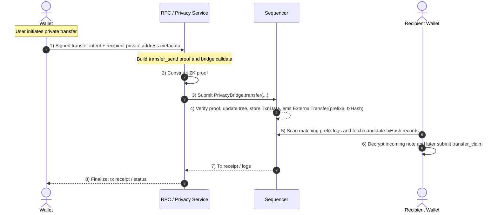

---
metaLinks:
  alternates:
    - https://app.gitbook.com/s/yE16Xb3IemPxJWydtPOj/basics/editor
---

# Private Transfers

There are two ways to perform private transfers on Payy:

1. Directly call [`PrivacyBridge`](../protocol/privacybridge.md) with the required ZK proof.
2. Use a wallet / RPC compatibility layer such as a [`Privacy Vault`](../protocol/privacy-vault.md) that constructs the proof for you.

## Direct-Receive Design

Payy's current private transfer design is direct-send, not inbox-based bearer delivery.

The sender targets the recipient's Payy private address:

- the recipient shares a hex-encoded compressed 32-byte Grumpkin public key off-chain, using the [canonical private-address encoding](../protocol/privacy-layer/private-address.md)
- the proof derives the recipient note owner from that key
- the bridge stores recipient-encrypted note material on-chain
- the bridge emits `ExternalTransfer(prefix6, txHash)` so the recipient can discover candidate transfers without scanning every privacy transaction

The recipient later calls `transfer_claim` to merge the incoming note into their normal wallet note chain.

## Wallet / RPC Compatibility Layer

A compatibility layer can still make privacy transfers feel like ordinary wallet sends, but it must know the recipient's private address in addition to the transfer intent.

As the transaction data is private, the receiving party still needs the note material in order to access funds. In the current design that material is delivered by the bridge itself:

- `transfer_send` stores sender-side and recipient-side encrypted note bundles in `TxnData`
- the bridge emits a prefix-filterable discovery log
- the recipient wallet fetches `txHash`, attempts decryption, and then claims the note on-chain

No off-chain Private Transfer Inbox publish step is required for the standard flow.

<figure><figcaption></figcaption></figure>

The following describes the process flow:

* Wallet signs a native or ERC-20 transfer request and sends it to the RPC or privacy service layer.
* RPC / privacy service resolves the recipient's Payy private address from wallet metadata, contacts, or an application-level address book.
* The service constructs a `transfer_send` proof asserting:
  * the sender's spend authority
  * the sender continuation note
  * the recipient-owned incoming note
  * the sender and recipient encryption bindings committed in public inputs
* The service submits `PrivacyBridge.transfer(verificationKeyHash, proof, publicInputs, userEncryptedKey, recipientEncryptedKey, memo)`.
* Sequencer executes the transaction, verifies the proof, stores `TxnData`, updates the privacy pool state, and emits `ExternalTransfer(prefix6, txHash)`.
* Recipient wallet watches logs matching its prefix, fetches candidate `txHash` records, decrypts the recipient payload, and later submits `transfer_claim`.
* RPC returns the transaction receipt / logs to the sender wallet.

